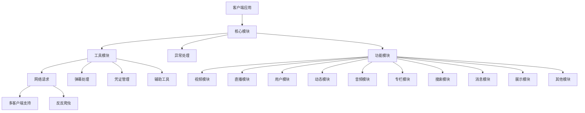
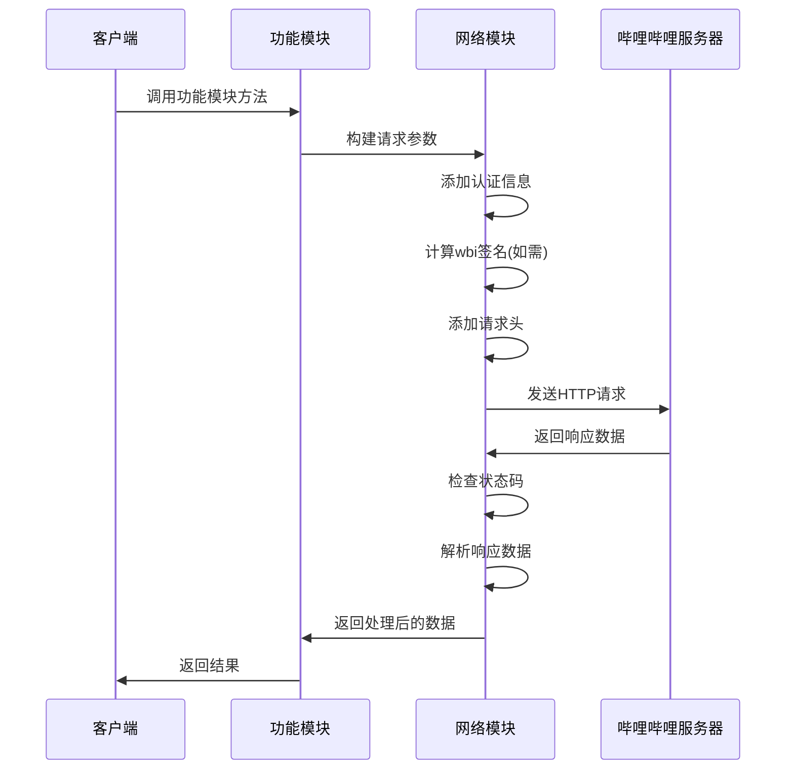
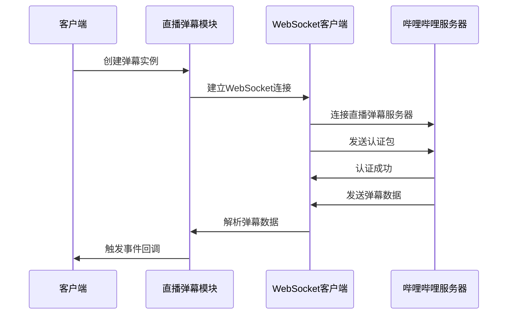
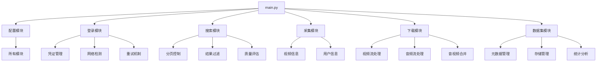
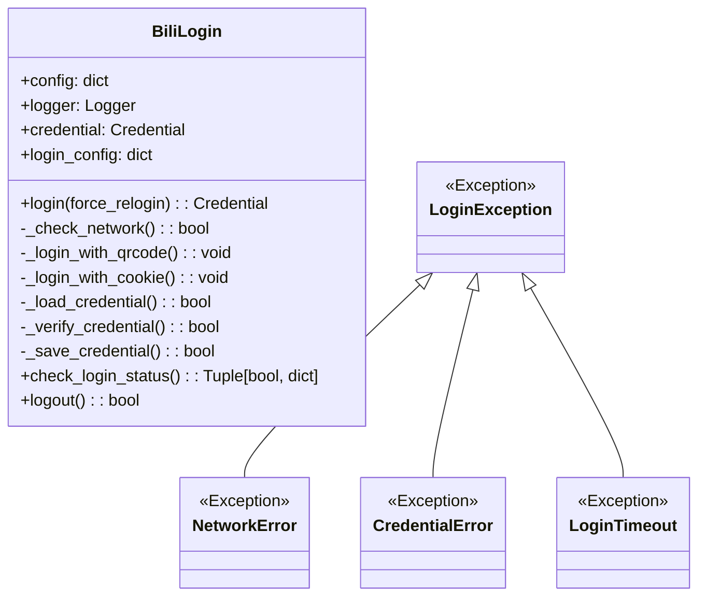
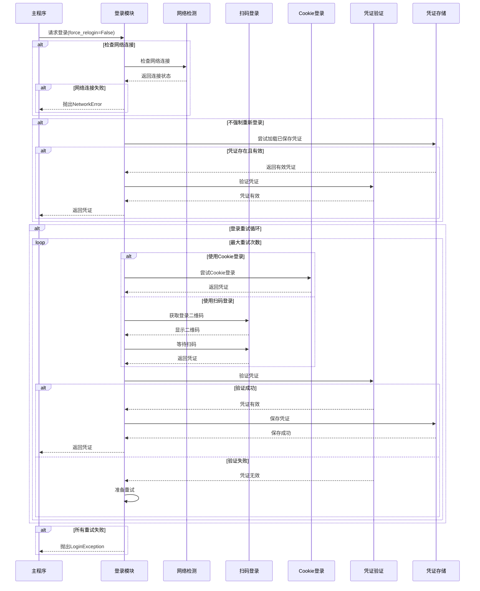

# Bilibili-API 系统架构

## 整体架构

Bilibili-API 采用模块化设计，将不同功能区分为独立的模块，便于维护和扩展。整体架构如下：



## 核心组件

### 1. 核心模块 (`bilibili_api/__init__.py`)

作为入口点，提供基础功能和全局设置，导出所有子模块和工具类。

### 2. 工具模块 (`bilibili_api/utils/`)

包含各种辅助功能的工具集合：

- **网络请求 (`network.py`)**：处理 HTTP 请求，支持多种请求库
- **凭证管理 (`Credential`)**：管理用户登录凭证
- **弹幕处理 (`danmaku.py`)**：处理弹幕相关功能
- **事件处理 (`AsyncEvent.py`)**：处理异步事件
- **人机验证 (`geetest.py`)**：处理极验验证码
- **AV/BV 互转 (`aid_bvid_transformer.py`)**：视频号格式转换

### 3. 异常处理 (`bilibili_api/exceptions/`)

定义各种可能出现的异常，提供统一的异常处理机制。

### 4. 功能模块 (`bilibili_api/`)

提供各种具体功能的模块，如视频、直播、用户等。

### 5. 数据模块 (`bilibili_api/data/`)

存储 API 接口和各种静态数据，使用 JSON 格式存储，便于跨语言使用。

### 6. 工具包 (`bilibili_api/tools/`)

提供额外的实用工具，如 IVI 文件管理、解析器等。

## 主要设计模式

### 1. 模块化设计

将不同功能划分为独立的模块，每个模块负责特定的功能领域，如视频、直播、用户等。

### 2. 工厂模式

通过 `select_client` 函数实现客户端工厂，根据需要选择不同的请求库实现。

```python
def select_client(client_name: str) -> None:
    """
    选择请求库

    Args:
        client_name (str): 请求库名称，支持 "aiohttp", "httpx", "curl_cffi"
    """
```

### 3. 单例模式

使用全局的 `request_settings` 对象管理请求设置，确保全局一致性。

### 4. 装饰器模式

使用装饰器实现各种功能的增强，如请求重试、异常处理等。

### 5. 策略模式

针对不同的请求库实现不同的请求策略，通过统一接口进行调用。

### 6. 观察者模式

通过 `AsyncEvent` 类实现异步事件通知机制，用于处理直播弹幕等实时数据。

### 7. 适配器模式

为不同的请求库实现适配器，提供统一的接口。

## 关键技术决策

### 1. 全异步设计

项目从 v5 版本开始全面采用异步设计，提高性能和并发能力。基于 `asyncio` 实现异步操作，所有网络请求都是异步的。

### 2. 多客户端支持

支持多种请求库 (`aiohttp`、`httpx`、`curl_cffi`)，用户可根据需要选择。按优先级自动选择可用的请求库，也可手动指定。

```python
from bilibili_api import select_client

select_client("curl_cffi")  # 选择 curl_cffi 作为请求库
```

### 3. 反反爬虫策略

实现多种反反爬虫策略，如 wbi 签名计算、buvid 刷新、bili_ticket 刷新、代理设置等。

```python
from bilibili_api import request_settings

request_settings.set_proxy("http://your-proxy.com")  # 设置代理
```

### 4. 凭证管理

通过 `Credential` 类统一管理用户凭证，支持各种验证方式。

```python
from bilibili_api import Credential

credential = Credential(sessdata="...", bili_jct="...", buvid3="...")
```

### 5. API 数据分离

将 API 接口信息存储在 JSON 文件中，与代码分离，便于维护和跨语言使用。

### 6. 同步执行支持

虽然主要使用异步，但提供 `sync` 函数将异步代码同步执行，方便不熟悉异步的用户。

```python
from bilibili_api import sync

result = sync(async_function())
```

## 数据流

### 请求流程



### 直播弹幕流程



## 扩展性设计

1. **模块化架构**：便于添加新的功能模块
2. **插件式请求库**：支持添加新的请求库适配器
3. **数据与代码分离**：API信息存储在JSON文件中，便于更新
4. **统一的异常处理**：便于添加新的异常类型
5. **事件驱动机制**：通过AsyncEvent支持事件处理

## 敏感视频爬虫项目架构

敏感视频爬虫项目是基于bilibili-api库开发的应用，用于采集和管理B站上的特定视频内容。项目采用模块化设计，各模块间通过明确的接口进行交互。

### 架构概览



### 登录模块

登录模块(`login.py`)负责处理B站账号登录、凭证管理和会话维护。该模块具有高可靠性和容错性，支持多种登录方式和自动重试机制。

#### 登录模块结构



#### 登录流程



#### 错误处理与重试机制

登录模块实现了全面的错误处理和自动重试机制，主要包括：

1. **异常分类**：
   - `LoginException`: 登录异常基类
   - `NetworkError`: 网络连接错误
   - `CredentialError`: 凭证错误
   - `LoginTimeout`: 登录超时错误

2. **重试策略**：
   - 最大重试次数可配置
   - 重试间隔采用指数退避策略
   - 不同类型错误采用不同处理策略

3. **网络故障检测**：
   - 登录前检查网络连接
   - 支持多服务器测试
   - TCP和HTTP双重检测
   - 自定义超时设置

#### 与其他模块交互

登录模块作为基础设施，为其他模块提供认证支持：

1. **与搜索模块交互**：提供经过认证的请求凭证，用于执行搜索操作
2. **与采集模块交互**：提供凭证以获取完整视频信息和统计数据
3. **与下载模块交互**：提供凭证以获取视频下载链接和权限

### 搜索模块

// ... existing code ... 